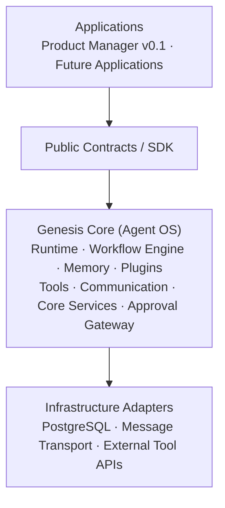

# Genesis

> **An extensible Agent Operating System for building autonomous AI applications.**

Genesis provides the dependable infrastructure that agentic applications need: a unified runtime, memory system, workflow orchestration, plugin architecture, and human-approval controls. Applications bring domain intelligence; Genesis makes their execution predictable, observable, and extensible.

## Overview

Teams building AI agents repeatedly rebuild execution loops, memory handling, coordination, tool integration, and safety controls. Genesis treats these as shared infrastructure concerns rather than application features.

The first reference application, **AI Product Manager**, will validate the Core by generating product-management artifacts while remaining entirely outside the Core's domain model.

## Vision

Genesis aims to become a general-purpose substrate for autonomous AI applications: applications should focus on their domain, while the platform provides reliable execution, auditable state, replaceable subsystems, and human oversight for consequential actions.

The central architectural rule is simple: **Applications depend on Core; Core never depends on Applications.**

## Key Features

- **Agent runtime** — lifecycle-managed execution with pause, resume, and termination semantics.
- **Workflow orchestration** — declarative, graph-based coordination for multi-step and multi-agent work.
- **Memory abstractions** — working and persistent memory behind replaceable interfaces.
- **Plugin and tool systems** — extensible capabilities without modifying Core internals.
- **Human approval gateway** — explicit checkpoints for important or irreversible actions.
- **Observable autonomy** — logged state transitions, reconstructable workflows, and auditable decisions.
- **Contract-first design** — stable public interfaces that let applications evolve independently of implementations.

## Architecture



Genesis follows a layered, hexagonal-influenced architecture. Core exposes ports and public contracts; concrete infrastructure lives behind adapters. Applications consume public Core contracts only and never reach into Core internals.

## Technology Stack

| Area | Technology |
| --- | --- |
| Frontend | Next.js, React, TypeScript, Tailwind CSS |
| Backend | FastAPI, Python |
| Persistence | PostgreSQL, SQLAlchemy, Alembic |
| Agent orchestration | LangGraph |
| Authentication | JWT |
| Tooling | pnpm, Ruff, MyPy, Pytest, Prettier |

## Repository Structure

```text
.
├── core/                 # Application-agnostic Agent OS subsystems and public contracts
├── applications/         # Applications built on Core (starting with product_manager)
├── packages/             # Shared Python and TypeScript libraries
├── infra/                # Deployment, migrations, and environment infrastructure
├── docs/                 # Canonical architecture and engineering documentation
├── scripts/              # Repository-wide automation
├── tests/                # Integration, contract, and end-to-end tests
└── .github/              # CI/CD workflows and GitHub templates
```

See [docs/04-Folder-Structure.md](docs/04-Folder-Structure.md) for the complete ownership and dependency rules.

## Getting Started

Genesis is currently in repository-foundation development. The application services have not yet been initialized.

### Prerequisites

- Git
- Python 3.12+
- Node.js 22+
- pnpm 10+ (via Corepack)

### Prepare the workspace

```bash
git clone <repository-url>
cd genesis
corepack enable
pnpm install
pnpm format:check
```

Backend and frontend startup instructions will be added as those components are implemented.

## Development Status

Genesis is in **v0.1 Foundation** development.

| Area | Status |
| --- | --- |
| Repository layout | Complete |
| Root tooling configuration | Complete |
| Core FastAPI backend | Not yet initialized |
| Reference application frontend | Not yet initialized |
| Database, migrations, and runtime | Planned |

## Documentation Guide

The documentation set is the source of truth for this project.

| Start here | Purpose |
| --- | --- |
| [Project Context](docs/00-GENESIS_CONTEXT.md) | Core invariants and the Separation Principle |
| [Vision](docs/01-Vision.md) | Why Genesis exists and what success looks like |
| [System Architecture](docs/02-System-Architecture.md) | Layers, contracts, and dependency direction |
| [Technology Stack](docs/03-Tech-Stack.md) | Chosen technologies and rationale |
| [Folder Structure](docs/04-Folder-Structure.md) | Repository ownership and filesystem rules |
| [Development Workflow](docs/12-Development-Workflow.md) | Review, testing, and delivery process |
| [Roadmap](docs/13-Roadmap.md) | Phased evolution from beta to platform |

## Roadmap

1. **v0.1 — Foundation:** establish Core abstractions and validate them with the AI Product Manager reference application.
2. **v0.2 — Hardening:** strengthen lifecycle guarantees, observability, and approval workflows.
3. **v0.3 — Ecosystem Enablement:** stabilize contracts and support external applications and plugins.
4. **v1.0 — Stable Core:** publish backward-compatibility guarantees and a production deployment reference.

See the full [roadmap](docs/13-Roadmap.md) for milestones and exit criteria.

## Contributing

Contribution guidance is forthcoming. Until then, contributors should follow the documented architecture, dependency rules, coding standards, and development workflow before proposing changes.

## License

License terms are forthcoming.
